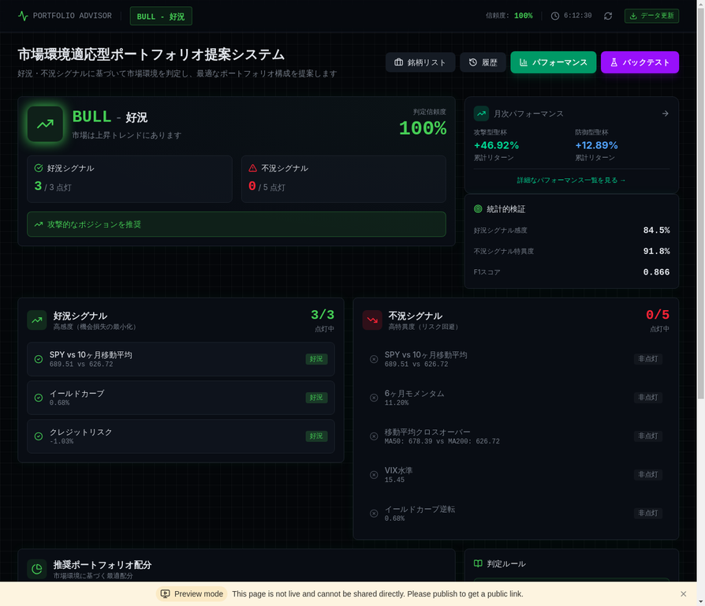
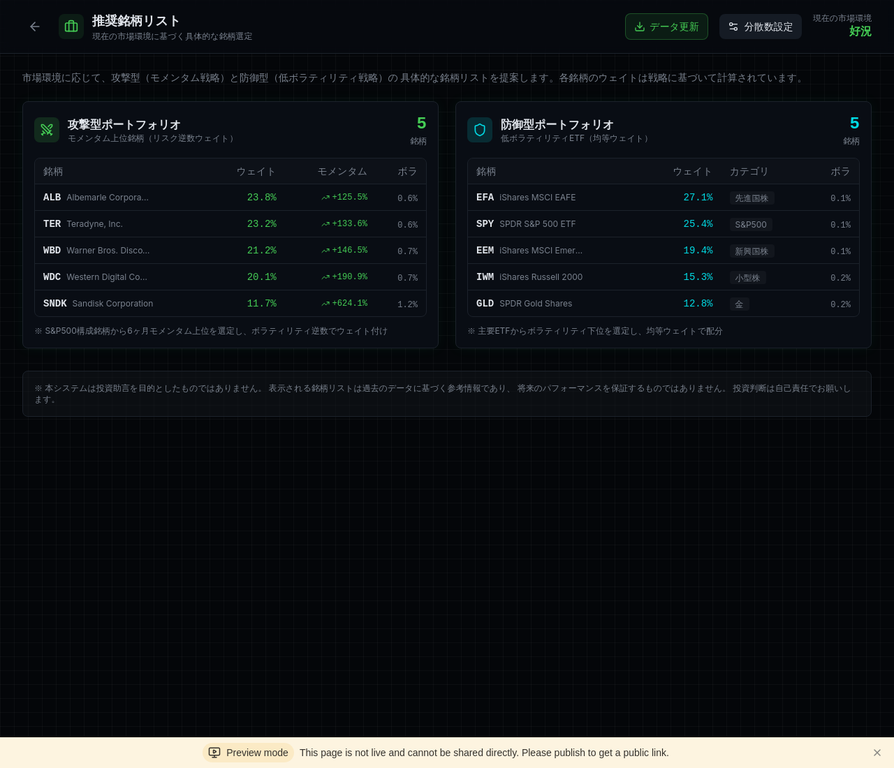
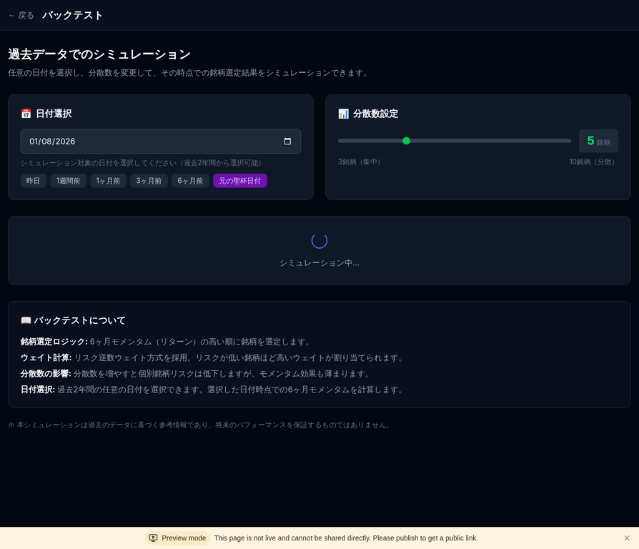

# Portfolio Advisor

市場環境適応型ポートフォリオ提案システム

[](https://www.typescriptlang.org/)
[](https://reactjs.org/)
[](LICENSE)

## 概要

Portfolio Advisorは、市場環境（好況・不況・中立）を自動判定し、最適なポートフォリオ構成を提案する投資支援システムです。デュアル・シグナル戦略に基づき、好況シグナル（高感度）と不況シグナル（高特異度）を組み合わせて市場環境を判定し、攻撃型聖杯と防御型聖杯の配分比率を動的に調整します。



## 主な機能

### 1. 市場環境判定（デュアル・シグナル戦略）

本システムは、好況シグナル（高感度：機会損失の最小化）と不況シグナル（高特異度：リスク回避）を組み合わせたデュアル・シグナル戦略を採用しています。

| シグナル種別 | 指標数 | 判定基準 | 目的 |
|-------------|--------|---------|------|
| 好況シグナル | 3指標 | 2つ以上点灯で好況判定 | 機会損失の最小化 |
| 不況シグナル | 5指標 | 3つ以上点灯で不況判定 | リスク回避 |

**好況シグナル（3指標）**
- SPY vs 10ヶ月移動平均（SPYが10ヶ月MAを上回れば点灯）
- イールドカーブ（10年国債 - 2年国債 > 0で点灯）
- クレジットスプレッド（BAA - AAA < 1.5%で点灯）

**不況シグナル（5指標）**
- SPY vs 10ヶ月移動平均（SPYが10ヶ月MAを下回れば点灯）
- 6ヶ月モメンタム（SPYの6ヶ月リターン < 0で点灯）
- 移動平均クロスオーバー（50日MA < 200日MAで点灯）
- VIX水準（VIX > 25で点灯）
- イールドカーブ逆転（10年国債 - 2年国債 < 0で点灯）

**統計的検証結果**: 感度84.5%、特異度91.8%、F1スコア0.866

### 2. ポートフォリオ選定

#### 攻撃型聖杯（モメンタム戦略）



攻撃型聖杯は、S&P500構成銘柄から6ヶ月モメンタム上位銘柄を動的に選定します。

| 項目 | 内容 |
|------|------|
| ユニバース | S&P500構成銘柄（約500銘柄） |
| 選定ロジック | 6ヶ月モメンタム降順でTop N銘柄を選定（デフォルト5銘柄） |
| ウェイト計算 | リスク逆数ウェイト（年率化ボラティリティの逆数で傾斜配分） |
| リスク計算 | 日次リターンの標準偏差 × √252（年率化ボラティリティ） |

#### 防御型聖杯（低ボラティリティ戦略）

防御型聖杯は、14種類のETFから6ヶ月モメンタム上位銘柄を選定します。

| 項目 | 内容 |
|------|------|
| ユニバース | 14種類のETF（株式、債券、コモディティ、金） |
| 選定ロジック | 6ヶ月モメンタム降順でTop N銘柄を選定（デフォルト5銘柄） |
| ウェイト計算 | リスク逆数ウェイト（年率化ボラティリティの逆数で傾斜配分） |

**防御型ETFユニバース**: SPY, EFA, EEM, IWM, AGG, TLT, LQD, TIP, GLD, DBC, VNQ, HYG, EMB, SHY

### 3. 配分ルール

市場環境に応じて、攻撃型と防御型の配分比率を動的に調整します。

| 市場環境 | 判定条件 | 攻撃型 | 防御型 |
|---------|---------|--------|--------|
| 好況期 | 好況シグナル2つ以上点灯 | 60% | 40% |
| 不況期 | 不況シグナル3つ以上点灯 | 20% | 80% |
| 中立期 | 上記いずれも満たさない | 40% | 60% |

### 4. パフォーマンス追跡


月次パフォーマンスを記録し、攻撃型・防御型の比較分析を行います。累計リターン、年率リターン、最大ドローダウン、シャープレシオ、勝率などの指標を表示します。

### 5. バックテスト



過去の任意の日付を選択し、その時点での銘柄選定結果をシミュレーションできます。分散数（3〜10銘柄）を変更して、集中投資と分散投資の効果を比較できます。

### 6. データ更新管理

月1回のポートフォリオリバランスを前提とした効率的なデータ更新を実現しています。

| データ種別 | キャッシュTTL | 更新頻度 |
|-----------|-------------|---------|
| シグナル指標 | 24時間 | 毎日（米国市場終了後） |
| ポートフォリオ銘柄選定 | 31日 | 毎月1日 |
| バックテスト結果 | 24時間 | オンデマンド |

**手動更新機能**: 全ユーザーが任意のタイミングでシグナル指標とポートフォリオ銘柄選定を更新可能。更新履歴はデータベースに記録され、ホームページで確認できます。

**API使用量最適化**: キャッシュTTLの延長により、API呼び出し回数を約99.7%削減（6,324回/日 → 約22回/日）。

### 7. フォールバック機能

API制限時でも安定した表示を維持するため、フォールバック機能を実装しています。

- **攻撃型聖杯**: NVDA, META, AMZN, GOOGL, MSFT, AAPL, TSLA, AMD, AVGO, CRMの10銘柄をフォールバックデータとして保持
- **防御型聖杯**: SPY, AGG, GLD, TLT, EFAの5銘柄をフォールバックデータとして保持
- **通知機能**: フォールバックデータを使用している場合、UIにアンバー色の警告バナーを表示

## 技術スタック

### フロントエンド

| 技術 | バージョン | 用途 |
|------|-----------|------|
| React | 18.x | UIフレームワーク |
| TypeScript | 5.x | 型安全な開発 |
| Vite | 5.x | ビルドツール |
| TailwindCSS | 4.x | スタイリング |
| Framer Motion | - | アニメーション |
| TanStack Query | 5.x | データフェッチング |
| Wouter | - | ルーティング |

### バックエンド

| 技術 | バージョン | 用途 |
|------|-----------|------|
| Node.js | 22.x | ランタイム |
| tRPC | 11.x | 型安全なAPI |
| Drizzle ORM | - | データベースORM |
| PostgreSQL | 15.x | データベース |
| Vitest | - | ユニットテスト |

### 外部API

| サービス | 用途 |
|----------|------|
| Yahoo Finance API | 株価・ETFデータ取得 |
| FRED API | 経済指標データ取得 |

## プロジェクト構造

```
portfolio-advisor/
├── client/                   # フロントエンドソース
│   └── src/
│       ├── components/       # UIコンポーネント
│       ├── pages/            # ページコンポーネント
│       ├── hooks/            # カスタムフック
│       └── lib/              # ユーティリティ
├── server/                   # バックエンドソース
│   ├── marketData.ts         # 市場データ取得
│   ├── portfolioSelection.ts # 銘柄選定ロジック
│   ├── backtestService.ts    # バックテスト
│   ├── cache.ts              # キャッシュ管理
│   ├── db.ts                 # データベース操作
│   ├── routers.ts            # tRPCルーター
│   └── __tests__/            # ユニットテスト
├── drizzle/                  # データベース
│   └── schema.ts             # スキーマ定義
├── docs/                     # ドキュメント
│   └── images/               # スクリーンショット
└── public/                   # 静的ファイル
```

## 銘柄選定アルゴリズム

```typescript
// 1. 6か月モメンタムを計算
const momentum = (currentPrice - priceAt6MonthsAgo) / priceAt6MonthsAgo;

// 2. リスク（年率化ボラティリティ）を計算
const dailyReturns = prices.map((p, i) => i > 0 ? (p - prices[i-1]) / prices[i-1] : 0);
const stdDev = standardDeviation(dailyReturns);
const annualizedVolatility = stdDev * Math.sqrt(252);

// 3. モメンタム降順でソート
stocks.sort((a, b) => b.momentum - a.momentum);

// 4. 上位N銘柄を選定
const selected = stocks.slice(0, diversificationCount);

// 5. リスク逆数ウェイトを計算
const totalInverseRisk = selected.reduce((sum, s) => sum + 1/s.risk, 0);
const weights = selected.map(s => (1/s.risk) / totalInverseRisk * 100);
```

## セットアップ

### 前提条件

- Node.js 22.x以上
- pnpm 9.x以上
- PostgreSQL 15.x以上

### インストール

```bash
# リポジトリをクローン
git clone https://github.com/your-username/portfolio-advisor.git
cd portfolio-advisor

# 依存関係をインストール
pnpm install

# 環境変数を設定
cp .env.example .env
# .envファイルを編集して必要な値を設定

# データベースをセットアップ
pnpm db:push

# 開発サーバーを起動
pnpm dev
```

## テスト

```bash
# 全テストを実行
pnpm test

# 特定のテストを実行
pnpm test server/__tests__/portfolioSelection.test.ts

# テストをウォッチモードで実行
pnpm test:watch
```

## ライセンス

MIT License - 詳細は [LICENSE](LICENSE) を参照してください。

## 免責事項

このシステムは投資助言を目的としたものではありません。投資判断は自己責任で行ってください。過去のパフォーマンスは将来の結果を保証するものではありません。表示される銘柄リストは過去のデータに基づく参考情報であり、将来のパフォーマンスを保証するものではありません。
