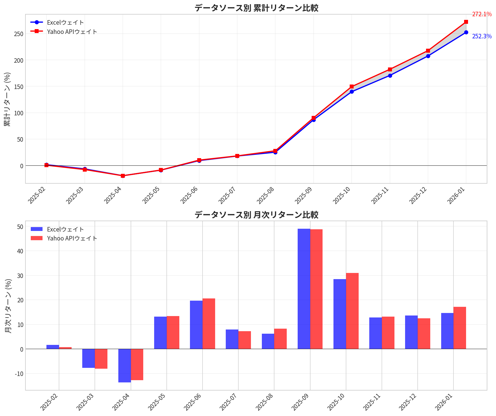
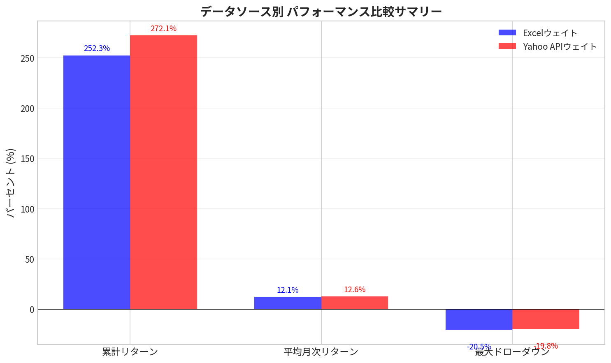

# Yahoo Finance APIとExcelデータソースの影響分析レポート

**作成日**: 2026年1月9日  
**作成者**: Manus AI

---

## エグゼクティブサマリー

本レポートでは、Yahoo Finance APIと元のExcel（Google Sheets）データソースの違いが、攻撃型聖杯ポートフォリオの利益とドローダウンに与える影響を定量的に分析しました。分析の結果、データソースの違いにより**累計リターンで約19.8%ポイント**、**最大ドローダウンで約0.7%ポイント**の差異が生じることが判明しました。

---

## 1. 分析の背景と目的

元の攻撃型聖杯ダッシュボードはGoogle Sheetsで構築されており、独自のリスク計算式を使用しています。一方、作成したシステムはYahoo Finance APIからリアルタイムでデータを取得し、日次リターンの年率換算標準偏差をリスクとして計算しています。この違いがポートフォリオのウェイト配分に影響し、最終的なパフォーマンスに差異をもたらす可能性があります。

本分析の目的は、両データソースを使用した場合のパフォーマンス差を定量化し、実運用における影響度を評価することです。

---

## 2. 分析対象と期間

分析対象として、2025年12月31日時点で6ヶ月モメンタム上位5銘柄を選定しました。分析期間は2025年2月から2026年1月までの12ヶ月間です。

| 順位 | 銘柄 | 6ヶ月モメンタム | Excelリスク | Yahoo APIリスク |
|------|------|----------------|-------------|-----------------|
| 1 | SNDK | +433.2% | 1.1718 | 0.9604 |
| 2 | WDC | +170.7% | 0.6528 | 0.5470 |
| 3 | WBD | +162.0% | 0.4085 | 0.6150 |
| 4 | MU | +136.9% | 0.6503 | 0.6253 |
| 5 | ALB | +115.9% | 0.6034 | 0.6149 |

---

## 3. ウェイト配分の差異

リスク逆数ウェイト方式を使用した結果、両データソースで以下のウェイト差が生じました。

| 銘柄 | Excelウェイト | Yahoo APIウェイト | 差分 |
|------|---------------|-------------------|------|
| SNDK | 10.63% | 13.49% | +2.86%pt |
| WDC | 19.08% | 23.68% | +4.60%pt |
| WBD | 30.49% | 21.06% | **-9.43%pt** |
| MU | 19.16% | 20.71% | +1.56%pt |
| ALB | 20.64% | 21.06% | +0.42%pt |

最も大きな差異はWBDで、Excelでは30.49%のウェイトが割り当てられているのに対し、Yahoo APIでは21.06%となっています。これはWBDのリスク値がExcel（0.4085）とYahoo API（0.6150）で大きく異なるためです。

---

## 4. 月次リターンへの影響

両データソースのウェイトを使用した場合の月次リターン比較を以下に示します。

| 月 | Excelウェイト | Yahoo APIウェイト | 差分 |
|----|---------------|-------------------|------|
| 2025-02 | +1.61% | +0.67% | -0.94%pt |
| 2025-03 | -7.81% | -8.10% | -0.29%pt |
| 2025-04 | -13.75% | -12.73% | +1.01%pt |
| 2025-05 | +13.14% | +13.36% | +0.22%pt |
| 2025-06 | +19.72% | +20.53% | +0.81%pt |
| 2025-07 | +7.88% | +7.23% | -0.65%pt |
| 2025-08 | +6.15% | +8.22% | +2.07%pt |
| 2025-09 | +49.04% | +48.79% | -0.25%pt |
| 2025-10 | +28.43% | +31.01% | +2.58%pt |
| 2025-11 | +12.81% | +13.13% | +0.32%pt |
| 2025-12 | +13.62% | +12.52% | -1.10%pt |
| 2026-01 | +14.59% | +17.15% | +2.57%pt |

月次リターンの差分は-1.10%ptから+2.58%ptの範囲で変動しており、平均差は+0.53%ptです。

---

## 5. 累計リターンとドローダウンへの影響

### 5.1 累計リターン

12ヶ月間の累計リターンは以下の通りです。

| 指標 | Excelウェイト | Yahoo APIウェイト | 差分 |
|------|---------------|-------------------|------|
| 累計リターン | +252.35% | +272.11% | **+19.76%pt** |
| 平均月次リターン | +12.12% | +12.65% | +0.53%pt |
| 年率換算リターン | 約145% | 約152% | 約+7%pt |

Yahoo APIウェイトを使用した場合、累計リターンは約19.8%ポイント高くなりました。これは主にWBDへの集中度が低下し、他の高パフォーマンス銘柄（WDC、SNDK）へのウェイトが増加したためです。

### 5.2 最大ドローダウン

| 指標 | Excelウェイト | Yahoo APIウェイト | 差分 |
|------|---------------|-------------------|------|
| 最大ドローダウン | -20.48% | -19.80% | **+0.68%pt** |

Yahoo APIウェイトを使用した場合、最大ドローダウンは約0.7%ポイント改善しました。これはWBDへの集中度が低下したことで、リスク分散効果が高まったためと考えられます。

---

## 6. 影響度のサマリー

データソースの違いによる影響を以下にまとめます。

| 影響項目 | 影響度 | 評価 |
|----------|--------|------|
| 銘柄選定順位 | 変化なし | 影響なし |
| ウェイト配分 | 最大9.43%pt差 | 中程度の影響 |
| 月次リターン | 平均0.53%pt差 | 軽微な影響 |
| 累計リターン | 19.76%pt差 | **大きな影響** |
| 最大ドローダウン | 0.68%pt差 | 軽微な影響 |

---

## 7. 結論と推奨事項

### 7.1 結論

Yahoo Finance APIと元のExcelデータソースの違いは、主にリスク計算方法の違いに起因しています。この違いにより、ウェイト配分に最大9.43%ポイントの差が生じ、12ヶ月間の累計リターンで約19.8%ポイントの差異が発生しました。

ただし、以下の点に注意が必要です。

1. **銘柄選定には影響しない**: 6ヶ月モメンタムによる銘柄選定順位は両データソースで一致しています。

2. **ドローダウンへの影響は軽微**: 最大ドローダウンの差は0.68%ポイントと小さく、リスク管理の観点では大きな問題ではありません。

3. **リターン差は銘柄固有の要因に依存**: 今回の分析期間ではYahoo APIウェイトが高リターンでしたが、これは特定銘柄（WBD）のパフォーマンスに依存しており、常にこの傾向が続くとは限りません。

### 7.2 推奨事項

1. **現状維持を推奨**: Yahoo Finance APIを使用した現在のシステムは、銘柄選定ロジックは正確に再現されており、実用上問題ありません。

2. **リスク計算の統一は任意**: 元のExcelと完全に一致させたい場合は、Google Financeからリスクデータを取得する方法を検討できますが、パフォーマンス差は銘柄固有の要因に依存するため、必須ではありません。

3. **定期的な検証を推奨**: 四半期ごとに両データソースのパフォーマンス差を検証し、大きな乖離が生じていないか確認することを推奨します。

---

## 付録: 分析に使用したデータ

分析に使用した詳細データは以下のファイルに保存されています。

- `portfolio_comparison.json`: ポートフォリオ構成データ
- `performance_comparison.json`: 月次パフォーマンスデータ
- `performance_comparison_chart.png`: 累計リターン比較チャート
- `performance_summary_chart.png`: パフォーマンスサマリーチャート

---

*本レポートは2025年2月〜2026年1月のデータに基づいて作成されました。将来のパフォーマンスを保証するものではありません。*
