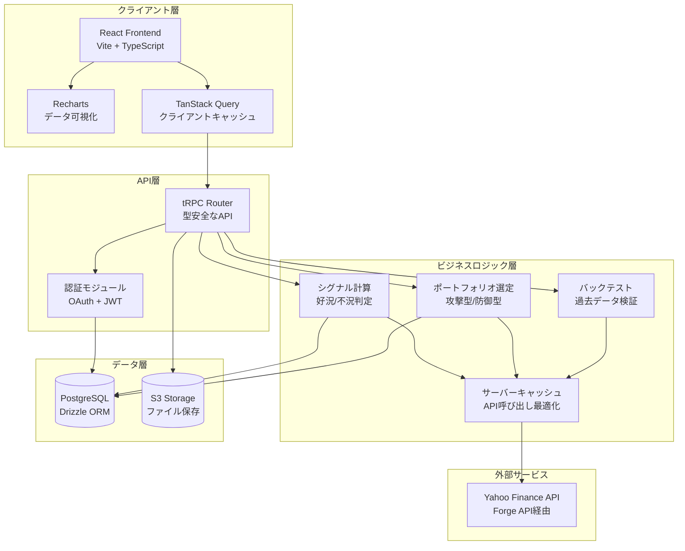
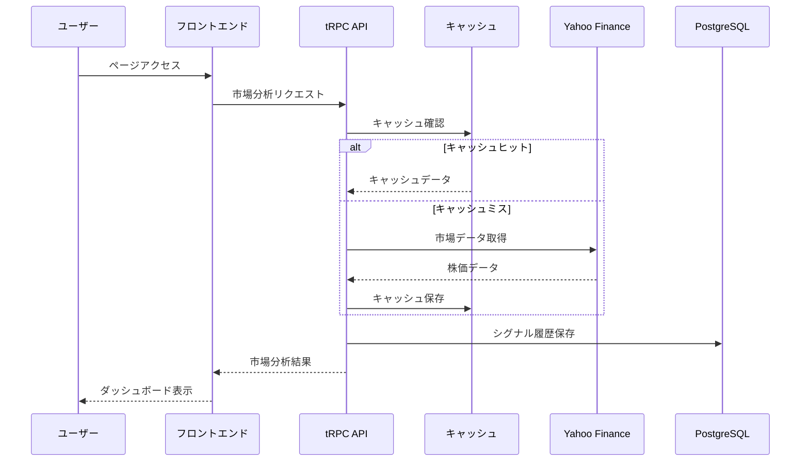
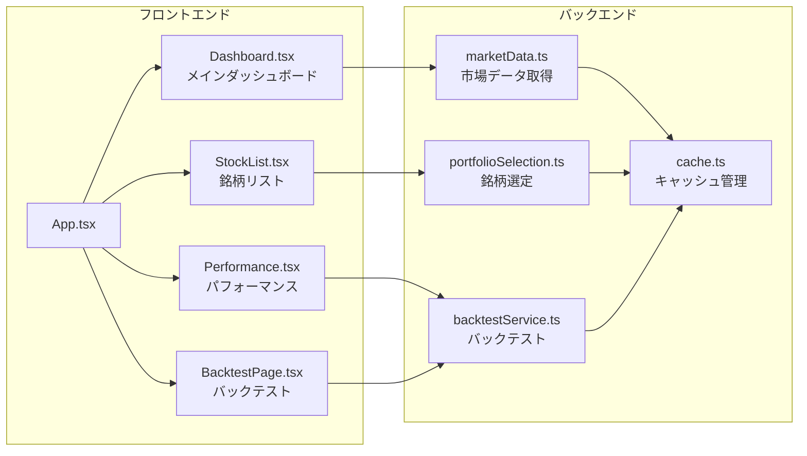
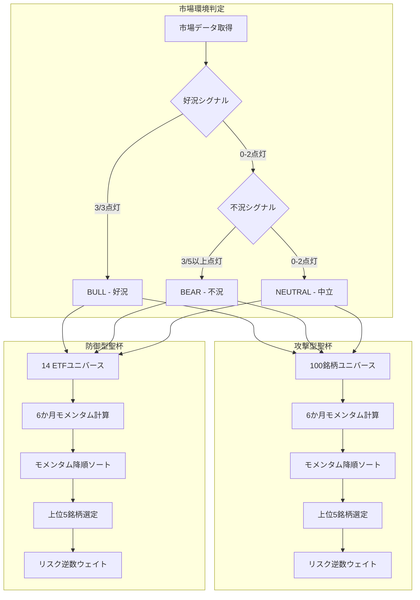

# Portfolio Advisor システム構成図

## システム概要

Portfolio Advisorは、市場環境に応じて最適なポートフォリオを提案する投資支援システムです。元の「聖杯ダッシュボード」のロジックを完全に再現しています。

## アーキテクチャ図



## データフロー図



## コンポーネント構成



## 聖杯ロジック詳細



## キャッシュ戦略

| データ種別 | キャッシュTTL | 理由 |
|-----------|-------------|------|
| 市場分析 | 5分 | リアルタイム性が重要 |
| 個別銘柄 | 15分 | 適度な鮮度を維持 |
| ポートフォリオ推奨 | 1時間 | 計算コストが高い |
| バックテスト | 24時間 | 過去データは不変 |

## 技術スタック

### フロントエンド
- **React 18** - UIフレームワーク
- **TypeScript** - 型安全な開発
- **Vite** - 高速ビルドツール
- **TailwindCSS** - ユーティリティファーストCSS
- **Shadcn/ui** - UIコンポーネント
- **Recharts** - チャートライブラリ
- **TanStack Query** - データフェッチング

### バックエンド
- **Node.js** - ランタイム
- **tRPC** - 型安全なAPI
- **Drizzle ORM** - データベースORM
- **PostgreSQL** - データベース

### インフラ
- **Manus Platform** - ホスティング
- **S3** - ファイルストレージ
- **Forge API** - 外部API連携

## ディレクトリ構造

```
portfolio-advisor/
├── src/                    # フロントエンドソース
│   ├── components/         # UIコンポーネント
│   ├── pages/              # ページコンポーネント
│   ├── hooks/              # カスタムフック
│   └── lib/                # ユーティリティ
├── server/                 # バックエンドソース
│   ├── marketData.ts       # 市場データ取得
│   ├── portfolioSelection.ts # 銘柄選定ロジック
│   ├── backtestService.ts  # バックテスト
│   ├── cache.ts            # キャッシュ管理
│   └── __tests__/          # テスト
├── db/                     # データベース
│   └── schema.ts           # スキーマ定義
├── docs/                   # ドキュメント
│   └── architecture.md     # 本ファイル
└── public/                 # 静的ファイル
```
